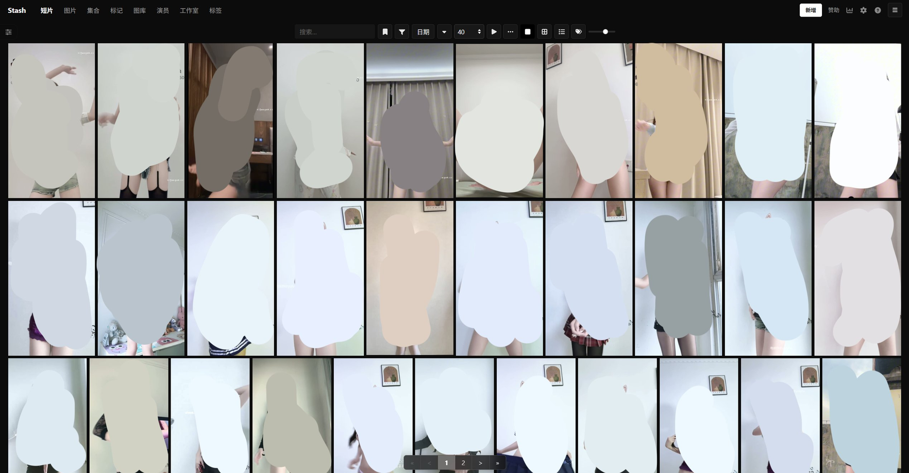
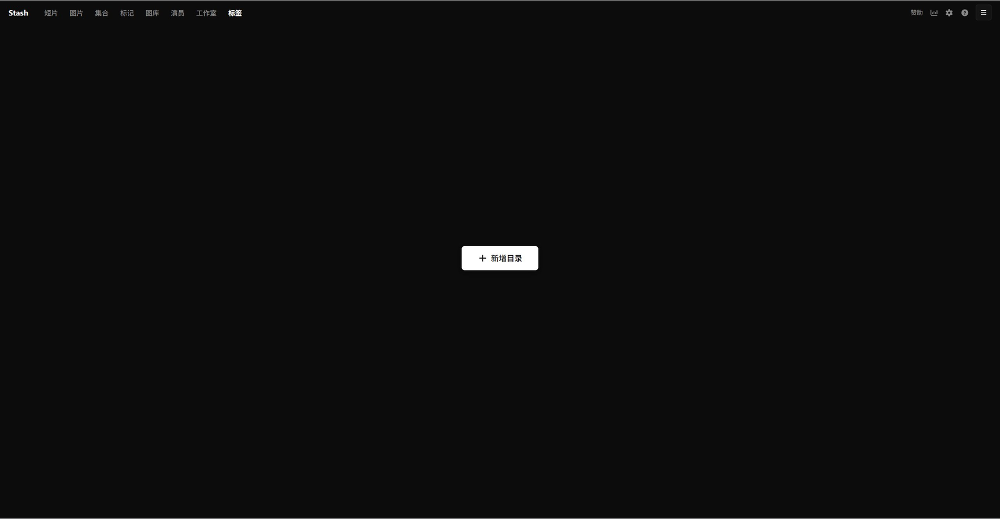
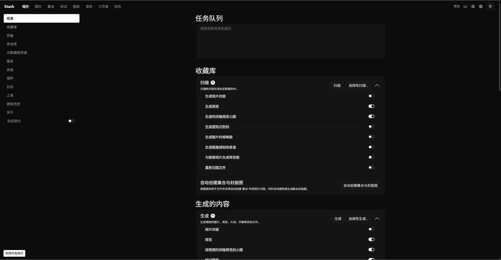

# Stash

[](https://github.com/lemon-o/stash/actions/workflows/docker-image.yml)
[](LICENSE)

> **本仓库是 [stashapp/stash](https://github.com/stashapp/stash) 的分支。**
> 在官方代码基础上做了源码级的界面改造：极简纯暗黑配色、默认预览墙视图、顶部导航与工具栏重构等。
> 完整的改动清单与代码定位见 [MODIFICATIONS.md](MODIFICATIONS.md)。
> 除界面表现层外，功能与上游保持一致，可随官方主线持续升级。

<h3>Stash 是一个用 Go 编写的自托管 Web 应用，用于整理并在线浏览你的媒体收藏，兼顾 SFW 与 NSFW 场景。</h3>



<sub>本分支的实际界面：极简纯暗黑主题（`#0c0c0c` / `#141414` 底色、纯白高光、无 Blueprint 蓝绿），列表默认以预览墙呈现。</sub>

- 从互联网抓取媒体信息，并可通过社区插件扩展，覆盖大量内容站点与制作方。
- 支持多种视频与图片格式。
- 可以给影片打标签，方便日后检索。
- 提供演员、标签、工作室等维度的统计。
- 支持从多个元数据源（stash-box、社区刮削器）自动识别与补全信息。

想先看效果，可以看官方的 [SFW 演示视频](https://vimeo.com/545323354)。

---

## 部署（Docker，推荐）

本分支同时发布 Docker 镜像与 Windows 安装包，均由脚本产出，客户端不需要任何 Go / Node 编译环境。

Docker 镜像由 GitHub Actions 在推送代码改动时自动构建并推送到 GitHub 容器仓库（GHCR），
同时提供 `linux/amd64` 与 `linux/arm64`。

| 项目 | 值 |
| :--- | :--- |
| 镜像地址 | `ghcr.io/lemon-o/stash` |
| 支持架构 | `linux/amd64`、`linux/arm64` |
| 镜像可见性 | 公开，**无需登录即可拉取** |
| 内置运行时 | 已包含 `ffmpeg` 与 `libvips`，无需自行安装 |
| 流水线 | [`.github/workflows/docker-image.yml`](.github/workflows/docker-image.yml)（冷缓存全程约 12 分钟） |

### 一键部署（docker compose）

```bash
mkdir -p /opt/stash && cd /opt/stash
curl -fsSLO https://raw.githubusercontent.com/lemon-o/stash/custom-ui/deploy/docker-compose.yml
# 按需修改文件里的媒体目录、端口与时区
docker compose up -d
```

也可直接新建 `docker-compose.yml` 配置文件：

```yaml
services:
  stash:
    image: ghcr.io/lemon-o/stash:latest
    container_name: stash
    restart: unless-stopped
    ports:
      - "9999:9999"

    # GPU 硬件转码加速（Intel N100 / QSV / AMD / 群晖等；不使用可注释此项）
    devices:
      - /dev/dri:/dev/dri

    environment:
      - TZ=Asia/Shanghai
      - STASH_STASH=/data/
      - STASH_GENERATED=/generated/
      - STASH_METADATA=/metadata/
      - STASH_CACHE=/cache/
      - STASH_PORT=9999

    volumes:
      - /etc/localtime:/etc/localtime:ro
      - ./config:/root/.stash        # 配置文件与数据库（最重要，务必备份）
      - /path/to/your/media:/data:ro # 你的媒体目录（替换为实际路径，可配置多行）
      - ./metadata:/metadata         # 元数据目录
      - ./cache:/cache               # 缓存目录
      - ./blobs:/blobs               # 二进制大对象目录
      - ./generated:/generated       # 生成的预览、缩略图
```

> [!TIP]
> **硬件转码生效说明**：添加 `devices: [/dev/dri:/dev/dri]` 后，容器会自动识别核显（如 Intel N100 / QSV / VA-API）。容器启动后，请在 Stash 网页端 **「设置 → 系统 → FFmpeg 硬件编码」** 中勾选开启即可。

浏览器打开 `http://<服务器IP>:9999` 即可（本机访问 `http://localhost:9999`）。

### 或者用 docker run

```bash
docker run -d \
  --name stash \
  --restart unless-stopped \
  -p 9999:9999 \
  --device /dev/dri:/dev/dri \
  -e STASH_STASH=/data/ \
  -e STASH_GENERATED=/generated/ \
  -e STASH_METADATA=/metadata/ \
  -e STASH_CACHE=/cache/ \
  -e STASH_PORT=9999 \
  -e TZ=Asia/Shanghai \
  -v /opt/stash/config:/root/.stash \
  -v /path/to/your/media:/data \
  -v /opt/stash/metadata:/metadata \
  -v /opt/stash/cache:/cache \
  -v /opt/stash/blobs:/blobs \
  -v /opt/stash/generated:/generated \
  ghcr.io/lemon-o/stash:latest
```

详细的目录说明、常见问题与排错见 **[deploy/README.md](deploy/README.md)**。

### 更新到新版本

```bash
docker compose pull && docker compose up -d
```

所有数据都保存在挂载到宿主机的目录里（配置与数据库在 `./config`），
更换镜像、删除容器都不会丢数据。

### 可用的镜像标签

| 标签 | 触发方式 | 说明 |
| :--- | :--- | :--- |
| `latest` | 推送到 `custom-ui` 分支、推送 `v*` 标签 | 最新构建，一般用这个 |
| `custom-ui` | 推送到 `custom-ui` 分支 | 与 `latest` 同一次构建，语义更明确 |
| `edge` | 推送到 `custom-ui` 分支 | 同上，表示「开发中」的构建 |
| `sha-1c38437` | 每次构建 | 固定到某个提交，适合固定版本部署 |
| `1.2.3` / `1.2` | 推送 `v1.2.3` 标签 | 正式版本号 |

只改动文档的推送不会触发构建；打版本标签与手动触发则一定会构建。
细节与耗时见 [deploy/README.md](deploy/README.md)。

> [!NOTE]
> 仓库里 `docker/production/` 下的 compose 文件是**上游的文件**，拉取的是官方镜像
> `stashapp/stash`。要部署本分支，请使用 `deploy/` 目录下的文件。

### Windows 桌面版

除 Docker 外，本分支也提供一个 Windows 安装包。形态与上游一致：**常驻系统托盘 + 用默认浏览器打开界面**
（和 [Sunshine](https://github.com/LizardByte/Sunshine) 同一种，不套壳、不内嵌浏览器、不依赖任何 Python 运行时）。

```powershell
# 仓库根目录执行；环境要求：git / corepack(pnpm) / Inno Setup 6 / bin\stash-win.exe
python 打包stash.py <版本号> --installer
```

产物 `Stash-Setup-<版本号>.exe` 落在桌面与 `dist\`。安装后：

| 项目 | 值 |
| :--- | :--- |
| 安装位置 | `%LOCALAPPDATA%\Programs\Stash`（按用户安装，全程不弹 UAC） |
| 启动方式 | 双击开始菜单/桌面图标 → 托盘图标常驻，并自动打开默认浏览器 |
| 退出 | 右键托盘图标 → `Quit Stash Server` |
| 前端 | `{app}\ui\build`，由配置项 `ui_location` 指向——改前端不必重编 Go |
| 配置与数据 | `%LOCALAPPDATA%\Stash\`（`config.yml` 及同目录下的数据库、缓存、缩略图） |
| 可选 | 安装时可勾选「开机自动启动」，写入 `HKCU\...\CurrentVersion\Run` |

> [!IMPORTANT]
> 安装包内置的是仓库 `bin\stash-win.exe`（本分支不在本地编译 Go）。要更新引擎，
> 先替换这个二进制，再重跑打包脚本；只改前端的话直接重跑即可。
>
> 安装器用的是**新的 AppId**，不会覆盖更早那版基于 PyInstaller 的桌面套壳包。
> 升级前请先卸载旧版（顺便释放 `C:\Program Files\StashCustom` 里约 500MB 的 Qt 运行时）。

### 想用官方原版或上游原生安装包

上游提供 Windows / macOS / 裸机 Linux 的官方二进制与安装包：
[stashapp/stash Releases](https://github.com/stashapp/stash/releases)。

---

## 首次运行

镜像已内置 ffmpeg 与 libvips，Docker 部署无需额外准备依赖。

启动后访问 `http://localhost:9999`，Stash 会引导你完成初始配置并选择要索引的媒体目录
（在 Stash 中称为 “Scanning”）。扫描完成后，媒体即可用于浏览、整理、编辑与打标签。

> [!TIP]
> 完整的安装与使用说明可参考官方文档：[docs.stashapp.cc/installation](https://docs.stashapp.cc/installation/)。
> 若以裸机方式运行（非 Docker），需要自行安装 `ffmpeg`，Linux 用户建议直接用发行版包管理器安装。

---

## 使用

Stash 是 Web 应用。程序运行后默认监听 `http://localhost:9999`。

Stash 可以通过[刮削器](https://github.com/stashapp/stash/blob/develop/ui/v2.5/src/docs/en/Manual/Scraping.md)
从各站点直接抓取元数据（演员、标签、简介、工作室等）。要识别整个媒体库，通常需要组合多个来源：

- **StashDB**：由 stashapp 团队维护的众包数据库，收录场景、工作室与演员信息，连接后可自动识别大部分常见媒体。
  它基于开源元数据 API [stash-box](https://github.com/stashapp/stash-box) 运行。
  接入方式、邀请码等信息见 [Accessing StashDB](https://guidelines.stashdb.org/docs/faq_getting-started/stashdb/accessing-stashdb/)。
- **社区 stash-box 实例**：还有多个社区维护的 stash-box 数据库，侧重点与方法论各不相同。
  各自的差异与注册方式见官方文档的 [Metadata Sources](https://docs.stashapp.cc/metadata-sources/stash-box-instances/)。
- **社区刮削器**：可在 Stash 内直接下载、安装与更新，覆盖更广泛的站点与数据库。
  路径为 `Settings → Metadata Providers → Available Scrapers → Community (stable)`。
  每个刮削器的用法略有差异，详见 [CommunityScrapers 仓库](https://github.com/stashapp/CommunityScrapers)。
- 以上几种方式的详细用法也整理在官方的 [Guide to Scraping](https://docs.stashapp.cc/beginner-guides/guide-to-scraping/) 中。

---

## 本分支的界面改造

改动集中在 `ui/v2.5/src` 的表现层与全局参数，属于**源码级**修改（而非 CSS 覆盖），
因此不会产生隐藏节点、也不会出现样式漂移。主要包含：

- 列表默认显示模式改为「预览墙（Wall）」，缩放滑块默认停在 70% 档位。
- 从 TSX 源码中直接删除列表顶部的页码栏与统计行，不生成任何 DOM。
- 第二层工具栏与顶部导航重构：固定高度、6px 间距、正方形按钮、纯文字导航、移动端横向平滑滚动。
- 全域极简纯暗黑配色（`#0c0c0c` / `#141414` / `#ffffff`），根除 Blueprint 蓝与绿色。
- 滑块轨道与外框的原生去框去蓝改造。

逐项的代码定位、改法与设计原则见 [MODIFICATIONS.md](MODIFICATIONS.md)。

### 界面预览

空媒体库 —— 首次使用时的极简呈现：



设置页 —— 任务队列、收藏库扫描选项与生成内容，同样是无框纯暗黑：



---

## 从源码构建

### 本地构建镜像

```bash
# 在仓库根目录执行；注意用的是 fork 专用的 docker/build/custom/Dockerfile
make docker-build-custom
```

> [!IMPORTANT]
> 不要用上游的 `docker/build/x86_64/Dockerfile`：其中 `RUN npm install -g pnpm` 没有锁定版本，
> 在 Alpine 上会因缺少 `@pnpm/exe` 的 musl 原生二进制而报
> `ERR_PNPM_PNPM_ENGINE_NO_NATIVE_BINARY`。
> `docker/build/custom/Dockerfile` 只把这一行固定为 `pnpm@10.33.0`（纯 JavaScript 实现），其余与上游一致。

### 前端开发热重载

无需在本地搭 Go 后端，可让 Vite 直接代理到一台已有的 Stash 服务：

1. 在 `ui/v2.5` 目录执行 `npx pnpm install`；
2. 在 `ui/v2.5/vite.config.js` 的 `server` 块中配置 `proxy` 指向你的服务地址；
3. 执行 `npx pnpm run start`，浏览器打开 `http://localhost:3000`，改动毫秒级热更新。

Windows 上也可以直接双击仓库根目录的 `start-dev.bat` 启动本地后端 + 前端热重载。

上游的架构说明、贡献指南与开发环境搭建见 [ARCHITECTURE.md](docs/ARCHITECTURE.md)、
[CONTRIBUTING.md](docs/CONTRIBUTING.md) 与 [DEVELOPMENT.md](docs/DEVELOPMENT.md)。

---

## 获取帮助与资源

需要帮助或想参与进来？建议先看文档，再到社区提问。

### 文档

- [官方文档](https://docs.stashapp.cc) —— 官方指南与排错。
- [应用内手册](https://docs.stashapp.cc/in-app-manual) —— 在应用内按 <kbd>Shift</kbd> + <kbd>?</kbd> 打开，也可在线查看。
- [常见问题](https://discourse.stashapp.cc/c/support/faq/28)。
- [社区 Wiki](https://discourse.stashapp.cc/tags/c/community-wiki/22/stash) —— 教程、经验与技巧。

### 社区与讨论

- [社区论坛](https://discourse.stashapp.cc) —— 支持、功能请求与讨论。
- [Discord](https://discord.gg/2TsNFKt) —— 实时交流。
- [GitHub Discussions](https://github.com/stashapp/stash/discussions)。
- [Lemmy 社区](https://discuss.online/c/stashapp)。

### 社区刮削器与插件

- [元数据源](https://docs.stashapp.cc/metadata-sources/)
- [插件](https://docs.stashapp.cc/plugins/)
- [主题](https://docs.stashapp.cc/themes/)
- [其他项目](https://docs.stashapp.cc/other-projects/)

---

## 架构

Stash 的整体架构概览见 [ARCHITECTURE.md](docs/ARCHITECTURE.md)。

## 参与贡献

欢迎任何形式的贡献。

参与之前请先阅读 [CONTRIBUTING.md](docs/CONTRIBUTING.md)，了解贡献规范与流程；
本地开发环境的搭建方式见 [DEVELOPMENT.md](docs/DEVELOPMENT.md)。

## 翻译

Stash 支持多语言界面。如果你想参与翻译，可以在
[Codeberg Translate](https://translate.codeberg.org/projects/stash/stash/) 注册账号后提交新的或已有的语言。
感谢所有译者！

[](https://translate.codeberg.org/engage/stash/)

## 致谢与许可

- 本项目基于 [stashapp/stash](https://github.com/stashapp/stash) 二次开发，感谢上游团队与社区。
- 遵循上游许可协议：[AGPL-3.0](LICENSE)。
